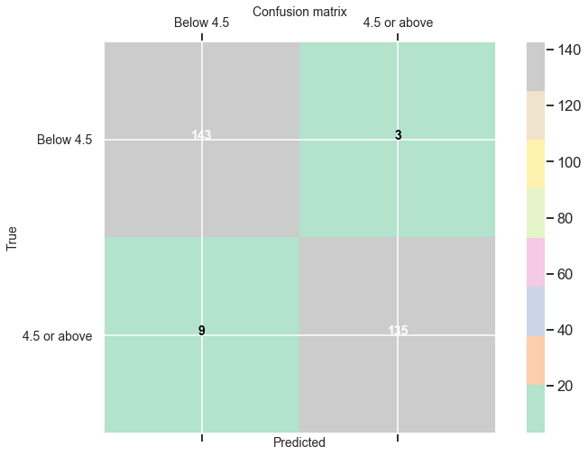

# Google Books Classification

## Goal

This project was an attempt to build a classification model that predicts whether or not a book has a 4.5 average rating or above on Google Books.

## The Dataset

For this project, I used data culled from the Google Books API. In particular, I made API calls for texts classified under the following subject categories:

- Fiction, Art, Computer Science, History, Philosophy, Economics, Poetry, Science, Mathematics, Psychology, Science, Drama, Travel, Religion, Biography, Architecture, Cooking, Education, Children

The Google API returns a large amount of data per book, much of which was not directly necessary for the goal. I parsed each call in order to isolate the following key-value pairs:

- Title, subtitle, author(s), publisher, categories, ratings count, page count, images/no images, e-book/no e-book, list price, and brief text synopsis 

In order to ensure that the books in my dataset each had sufficient bibliographic information, I only looked at books published since 2009. There were a little over 1100 books in the dataframe.

## Baseline

The percentage of books in my dataset with a 4.5 average rating or above was 39.69%; the percentage of books below that rating was 60.31%. This means that if a person randomly guessed that a particular book was below a 4.5 average rating, he or she would have approximately a 60% chance of guessing correctly. Thus, I needed my model to be able to predict with at least ~60% accuracy if a book has above a 4.5 average rating.

## Feature Engineering

All of the features used for modeling were categorical variables. I converted the publication dates to Pandas datetime objects and extracted the month and year from those objects, giving them separate columns. The reason for this is that I wanted to see if business cycles played a role in book popularity. Additionally, I made a "popular authors" column, which indicated with a 0 or 1 whether or not the author of a book appeared in the dataframe more than once. I imputed books' genre according to the subject category used for the API call that yielded the book. I then one-hot-encoded the month, year, genre, and publisher. I conducted natural language processing on the book descriptions, discussed below. 

 

## Natural Language Processing

Two techniques for vectorizing text in the book descriptions were used:
- Count Vectorizer
- TF-IDF Vectorizer

TF-IDF is a statistical weighting measure for a word's importance with respect to a collection of documents. The word's frequency count is multiplied by the log value of the total number of documents over the number of documents were the word appears. Thus, a word that appears frequently is penalized if it occur across all of the documents of a corpus, as this indicates that the term is of low importance. 

I ordered the words by TF-IDF score in descending value, one-hot-encoded them, and used only the 400 most highly ranked words. 

## Overfitting/Resampling

The first round of modeling included logistic regression, random forest, adaboost, gradient boost, XGBoost, support vector machine, and naive bayes. Each model displayed high training accuracy and low testing accuracy, indicating an overfitting problem. This is because there were much too many words in the feature space, and words that appeared relatively infrequently were not occuring in both the training and testing sets.

To work around this problem, I devised a custom sampling technique. I randomly resampled words that had a count of less than 100 in order to ensure that these relatively less frequent words had a 75/25 split in the training and testing sets. This technique significantly improved model accuracy in testing. However, this does make the model less generalizable to unseen data. 

I also cut the amount of features in the model by using only 100 words.

After resampling, I performed a second round of modeling. Each of the models displayed high training and testing scores that were more balanced:

## Final Model

The random forest model performed the best. Precision, recall, and F1 were all strong.

    Train score: 99.88%
    Test score: 95.86%
    Precision: 97.82%
    Recall: 93.75%
    F1 Score: 95.74%

    AUC: 95.84% 
    

Words in the feature space were high up on the random forest model's list of important features.  At the top of the list is the word 'times,' perhaps due to the descriptions of popular books mentioning the book's inclusion on the New York Times beseller list. Other significant features included whether or not the book had images in it and whether or not the book was available as an e-book. 

## Conclusions

This model is probably still overfitting and is thus not very generalizable. However, the methods I used could be applied to a much larger dataset and would likely work well, perhaps with a regularization technique. In the future, I will be exploring more creative techniques for dimensionality reduction.

The dataset I used was limited; it is difficult to get a large amount of books from the Google Books without a correspondingly large amount of API calls. Additionally, many books have rating counts as low as 1, so a high or low average rating would not be based on much. Finally, book descriptions are perhaps not the best feature for classifying ratings due to the lack of information contained in them. Reader reviews may prove more fruitful.